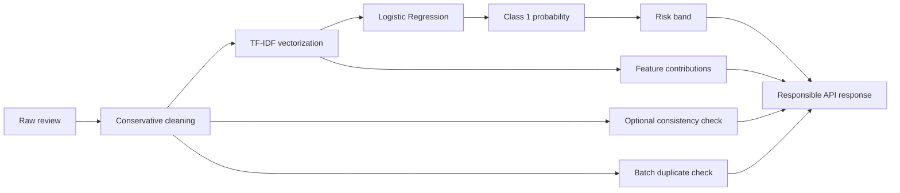

<p align="center">
  
</p>

<p align="center">
  <strong>Explainable machine learning for review-pattern screening.</strong><br />
  Analyze one review, a pasted batch, or a CSV—without marketplace scraping.
</p>

<p align="center">
  <a href="https://reviewradar-dxhb.onrender.com">Live API</a>
  ·
  <a href="https://reviewradar-dxhb.onrender.com/docs">Interactive Docs</a>
  ·
  <a href="./backend/MODEL_CARD.md">Model Card</a>
</p>

<p align="center">
  
  
  
  
</p>

---

## Why I built ReviewRadar

Product-review credibility is usually treated as a scraping problem. I initially explored marketplace links and browser automation, but anti-bot infrastructure quickly became a distraction from the part I wanted to demonstrate: **the machine-learning system itself**.

I refocused ReviewRadar into a marketplace-independent analyzer. Users provide review text directly—one review, a batch, or a CSV—and the API returns an interpretable risk assessment based on learned writing patterns.

This keeps the project focused on NLP classification, explainability, input cleaning, responsible output language, and API design.

> [!IMPORTANT]
> ReviewRadar highlights patterns associated with the model’s computer-generated class. It does not prove authorship, deception, or fraud.

## What it does

| Capability | What the API returns |
|---|---|
| **Single review** | Risk score, Low/Moderate/High band, cleaned text, and model-grounded reasons |
| **Batch analysis** | Per-review results, average risk, distribution, flagged percentage, and skipped count |
| **CSV analysis** | The same batch summary for a `review_text` column with an optional `rating` column |
| **Text cleaning** | Removes isolated ratings, dates, vote counts, and copied marketplace controls |
| **Explainability** | Surfaces TF-IDF words or phrases that contributed toward class `"1"` |
| **Consistency check** | Flags clear conflicts between an optional star rating and review sentiment |
| **Duplicate detection** | Groups exact normalized duplicates without changing model probabilities |

## How it works



### Risk interpretation

| Score | Band | Meaning |
|---:|---|---|
| `< 40` | **Low** | Few strong computer-generated writing signals were detected |
| `40–69.99` | **Moderate** | The text contains mixed ordinary and suspicious writing signals |
| `70–100` | **High** | The writing strongly resembles the model’s computer-generated training examples |

The score is the classifier’s probability for class `"1"`; it is **not** a measured percentage of fraudulent reviews.

## Explainability

ReviewRadar uses a TF-IDF vectorizer with Logistic Regression. For an individual review, it calculates each active feature’s contribution:

```text
TF-IDF value × Logistic Regression coefficient toward class "1"
```

The strongest positive contributions become plain-language reasons. Rating/text contradictions and duplicate matches are displayed as supporting context; they do not modify the classifier probability.

Example explanation:

```text
The model weighted phrases such as "highly recommend" and
"great product" toward the computer-generated class.
```

## Cleaning copied reviews

Copied marketplace text often includes interface clutter.

**Before**

```text
5 ★
Wonderful product
Certified Buyer
15 Jun, 2026
The stand feels stable and supports my laptop well.
Helpful? 43
Read More
Report Abuse
```

**After**

```text
Wonderful product. The stand feels stable and supports my laptop well.
```

The isolated rating can be retained separately for the consistency check. The cleaner intentionally preserves wording, capitalization, punctuation, negation, and spelling because these can matter to downstream analysis.

## API

### Health

```http
GET /
```

### Analyze one review

```http
POST /analyze
Content-Type: application/json
```

```json
{
  "text": "The battery lasted all day and setup took about ten minutes.",
  "rating": 4
}
```

Response shape:

```json
{
  "cleaned_text": "The battery lasted all day and setup took about ten minutes.",
  "risk_score": 24.53,
  "risk_band": "Low",
  "risk_label": "Computer-generated writing risk",
  "interpretation": {
    "headline": "Few strong computer-generated writing signals were detected.",
    "description": "The writing has low similarity to the computer-generated examples learned by the model."
  },
  "reasons": [
    "The model found few strong phrase-level indicators associated with computer-generated reviews."
  ],
  "disclaimer": "Highlights suspicious review patterns; does not prove fraud."
}
```

> Scores above are illustrative. Actual output depends on the saved model artifacts.

### Analyze a batch

```http
POST /analyze-batch
Content-Type: application/json
```

```json
{
  "reviews": [
    "The fit is comfortable after two weeks of use.",
    "Amazing product, highly recommended!",
    "The fit is comfortable after two weeks of use."
  ]
}
```

The response contains individual results plus submitted/analyzed/skipped counts, average risk, band distribution, flagged percentage, and duplicate groups.

### Analyze a CSV

```http
POST /analyze-csv
Content-Type: multipart/form-data
```

Expected columns:

```csv
review_text,rating
"The keyboard feels solid and quiet.",5
"Stopped charging after three days.",1
```

## Local setup

### 1. Clone

```bash
git clone https://github.com/Singhmehak07/ReviewRadar.git
cd ReviewRadar
```

### 2. Create a virtual environment

```bash
python -m venv .venv
```

**Windows PowerShell**

```powershell
.\.venv\Scripts\Activate.ps1
```

**macOS/Linux**

```bash
source .venv/bin/activate
```

### 3. Install dependencies

```bash
pip install -r backend/requirements.txt
```

### 4. Start the API

```bash
cd backend
python -m uvicorn main:app --reload
```

Open `http://127.0.0.1:8000/docs`.

## Run tests

```bash
python -m pytest backend/tests -q
```

The current backend suite contains **61 passing tests** covering prediction contracts, cleaning, consistency signals, duplicate handling, aggregation, CSV behavior, and responsible wording.

## Project structure

```text
ReviewRadar/
├── assets/
│   └── reviewradar-hero.svg
├── backend/
│   ├── models/
│   │   ├── risk_model.joblib
│   │   └── tfidf_vectorizer.joblib
│   ├── signals/
│   │   └── consistency.py
│   ├── tests/
│   ├── MODEL_CARD.md
│   ├── main.py
│   ├── predict.py
│   ├── requirements.txt
│   └── text_cleaning.py
├── data/
│   └── README.md
├── README.md
└── render.yaml
```

## Dataset

Dataset provenance, expected columns, label definitions, and local setup belong in [`data/README.md`](./data/README.md). Full training CSVs should remain outside Git unless their original license explicitly permits redistribution.

## Known limitations

- Short or generic genuine reviews can resemble generated templates and produce false positives.
- Advanced generated text may avoid vocabulary patterns learned from the training set.
- Results can degrade on languages, marketplaces, or writing styles outside the training distribution.
- ReviewRadar does not inspect reviewer identity, purchase verification, account history, timing, IP addresses, or coordinated networks.
- Batch results describe only the submitted sample—not every review for a product.
- Supporting consistency and duplicate signals do not change the ML probability.

See the [`Model Card`](./backend/MODEL_CARD.md) for detailed scope and responsible-use guidance.

## Project status

- **Backend MVP:** complete
- **Hosted API:** available on Render
- **Frontend:** planned separately
- **Training workflow cleanup:** maintained separately from the inference API

## Author

Built by [Mehakpreet Singh](https://github.com/Singhmehak07).

## License

The source code is intended for release under the [MIT License](./LICENSE). The training dataset remains subject to its original source terms and license.
